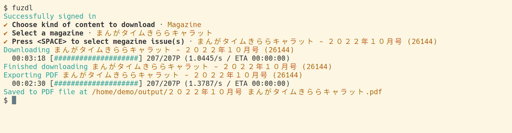

`fuzdl` is a CLI tool to download comics from *COMIC FUZ*.




# Install

## Dependencies

- `chromedriver`, which is available in repositories of most distros.

## Binary Download

A static binary built from the master branch is available at <https://github.com/kotatsuyaki/fuzdl-rs/releases/tag/latest>.

Dirty one-liner install command:

```
curl -LO https://github.com/kotatsuyaki/fuzdl-rs/releases/download/latest/fuzdl && sudo install --mode +x fuzdl /usr/local/bin
```

# Development

## Internal Documentation

Documentation generated by `rustdoc` for the master branch is available at <https://kotatsuyaki.github.io/fuzdl-rs/fuzdl>.


## Unit Tests

The unit tests in `src/states.rs` has special requirements to be run.

- The tests depend on `chromedriver` being available in `$PATH`.
- The tests can only be run single-threaded, since each test independently runs and stops its own instance of `chromedriver`.
  Use `cargo test -- --test-threads 1` to run the tests single-threaded.
